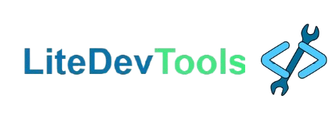

  

 

<h2>Introdução</h2>

LiteDevTools é uma startup fictícia com o propósito de desenvolver ferramentas online leves e simples para desenvolvedores e entusiastas da tecnologia.

É um projeto feito para competir no Hackteen 2025, cujo regulamento está disponível em https://drive.google.com/drive/folders/1LLx3ji749K5RveKrKzmf4Gd_cVOWiJmB

<h2>
  Como usar:
</h2>

Para usar o projeto, basta baixar o projeto compactado .zip diretamente desse repositório, descompactar e abrir index.html em um navegador

Alternativamente, é possível baixar o projeto usando o comando abaixo no diretório onde deseja baixá-lo
> git clone https://github.com/fasefo/projetoHackteen2025.git
