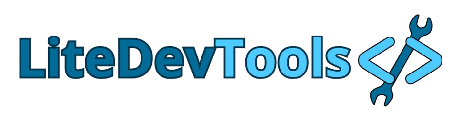

  

 

<h2>Introdução</h2>

 <strong>LiteDevTools </strong> é uma startup fictícia com o propósito de desenvolver  <strong>ferramentas online leves, acessíveis e intuitivas,</strong> voltadas para <strong>desenvolvedores, estudantes e entusiastas da tecnologia.</strong> Nosso foco está na criação de soluções digitais que não apenas facilitem o cotidiano de quem programa, mas também incentivem o aprendizado e a inovação.

O projeto foi idealizado e está sendo desenvolvido para competir no <strong>Hackteen 2025,</strong> uma competição voltada para jovens talentos do desenvolvimento e da inovação tecnológica. Esta iniciativa busca demonstrar o potencial criativo dos participantes na resolução de problemas reais por meio de soluções digitais eficazes.

Todas as ferramentas propostas pela LiteDevTools seguem os princípios de:
 
🚀<strong> Desempenho</strong> — códigos otimizados e responsivos
 
🧠 <strong>Simplicidade</strong> — interfaces limpas e diretas ao ponto
 
🌐 <strong>Acessibilidade</strong> — uso livre por qualquer navegador moderno

Este repositório contém o código-fonte da aplicação que representará a equipe no desafio. O regulamento completo do Hackteen 2025 pode ser consultado em:
 <a href="https://drive.google.com/drive/folders/1LLx3ji749K5RveKrKzmf4Gd_cVOWiJmB">🔗Regulamento Hackteen 2025</a>

 

<h2>
  Como usar:
</h2>

Para usar o projeto, basta baixar o projeto compactado .zip diretamente desse repositório, descompactar e abrir index.html em um navegador

Alternativamente, é possível baixar o projeto usando o comando abaixo no diretório onde deseja baixá-lo
> git clone https://github.com/fasefo/projetoHackteen2025.git
